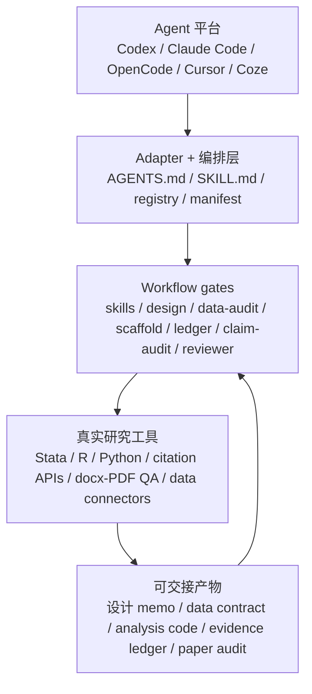

# Econ Paper Studio

面向实证经济学论文的 agent-native CLI / Skill 编排层。它把一篇经验研究拆成可检查、可交接、可追证据的阶段：上游 skills 路由、研究问题、识别策略、数据审计、代码骨架、稳健性核验、论文写作质检、证据账本、claim audit 和审稿式检查。

它不替研究者编造结果、引用或结论。它做的是把 agent 容易跳过的步骤固定下来：先说明问题和识别假设，再检查数据结构，再生成可复现代码，再核验方法证据和论文文本。


完整设计思路和框架见 [docs/DESIGN.md](docs/DESIGN.md)。

## 设计思路

`econ-paper-studio` 只做三件事：给 agent 明确下一步该用哪些 skills；把计量研究拆成可以检查的 workflow gates；把论文里的每条核心结论连回数据、代码、表图和引用核验状态。



真实可用的标准不是“生成一篇像论文的文本”，而是 agent 接手后能按顺序完成：先收窄问题和识别，再审计数据，再调用真实 Stata/R/Python 跑模型，把结果写入 evidence ledger，最后用 `claim-audit` 和 `reviewer-gauntlet` 检查正文 claim 是否被证据支持。

## 当前可用

| 阶段 | 命令 | 当前能力 |
|---|---|---|
| doctor | `econ-studio doctor --json` | 检查 Python 版本、关键文件、核心依赖和可选依赖 |
| skills | `econ-studio skills plan --task full-paper` | 根据任务给 agent 输出应加载的上游 skills；也可审计本地 skill 目录风险 |
| question | `econ-studio brainstorm` | 打开研究问题五问模板 |
| design | `econ-studio identify --brief <brief.yaml>` | 根据 brief 推荐 DiD/RDD/IV/SCM/Matching/DML，并给出识别威胁和稳健性清单 |
| design memo | `econ-studio design-memo --brief <brief.yaml>` | 把 brief 转成 estimand、识别假设、威胁和诊断要求 |
| data-audit | `econ-studio data-audit --csv <panel.csv> --key id --key year` | 检查空样本、重复键、缺失、处理变量变化、结果变量类型和聚类数量，并输出 data contract |
| execute | `econ-studio scaffold --strategy DiD --session <name> --lang stata` | 生成 Stata/R 分析骨架、表图目录和 replication-package 结构 |
| verify | `econ-studio verify --strategy DiD --analysis outputs\<name> --paper draft.md` | 静态扫描方法稳健性证据、空泛写作短语、引用占位符和因果过度声称 |
| evidence | `econ-studio ledger init/add/audit` | 记录表图、代码、数据、样本、模型、estimand、聚类层级和支持的 claim |
| claim audit | `econ-studio claim-audit --paper draft.md --ledger evidence_ledger.json` | 把论文核心 claim 映射回表图/代码/数据证据 |
| reviewer | `econ-studio reviewer-gauntlet --paper draft.md --ledger evidence_ledger.json` | 从方法、数据、引用、写作和复现五个视角做审稿式检查 |
| paper | `econ-studio paper outline/audit` | 从 brief 生成论文大纲，或审计草稿结构、贡献句、引用风险和图表标题 |
| session | `econ-studio init/list/show/add/add-review/promote` | 管理论文版本、审稿意见和终稿标记 |

## 快速试用

PowerShell 下直接跑：

```powershell
python -m pip install -e .

econ-studio doctor --json

econ-studio skills plan `
  --task full-paper

econ-studio identify `
  --brief examples\case-min-wage-did\research_brief.yaml `
  --output outputs\min-wage-demo\identify_strategy.md

econ-studio design-memo `
  --brief examples\case-min-wage-did\research_brief.yaml `
  --output outputs\min-wage-demo\design_memo.md

econ-studio data-audit `
  --csv examples\case-min-wage-did\panel_sample.csv `
  --required city_id `
  --required year `
  --required minimum_wage_increase `
  --required youth_employment_rate `
  --key city_id `
  --key year `
  --outcome youth_employment_rate `
  --treatment minimum_wage_increase `
  --cluster city_id `
  --min-clusters 3 `
  --output outputs\min-wage-demo\data_audit.md `
  --fail-on-critical

econ-studio scaffold `
  --strategy DiD `
  --session min-wage-demo `
  --lang stata

econ-studio verify `
  --strategy DiD `
  --analysis outputs\min-wage-demo `
  --paper examples\case-min-wage-did\draft_excerpt.md `
  --output outputs\min-wage-demo\verify_report.md `
  --fail-under 6

econ-studio paper outline `
  --brief examples\case-min-wage-did\research_brief.yaml `
  --output outputs\min-wage-demo\paper_outline.md

econ-studio paper audit `
  --paper examples\case-min-wage-did\draft_excerpt.md `
  --output outputs\min-wage-demo\paper_audit.md `
  --fail-under 8

econ-studio ledger init `
  --ledger outputs\min-wage-demo\evidence_ledger.json

econ-studio ledger add `
  --ledger outputs\min-wage-demo\evidence_ledger.json `
  --artifact-id table1 `
  --title "Baseline DiD estimates" `
  --artifact-path tables\table1.tex `
  --code-path do\03_main.do `
  --data-source examples\case-min-wage-did\panel_sample.csv `
  --sample "city-year panel" `
  --model "two-way fixed effects DiD" `
  --estimand ATT `
  --cluster city_id `
  --claim "Minimum wage changes affect youth employment" `
  --status needs_verification

econ-studio claim-audit `
  --paper examples\case-min-wage-did\draft_excerpt.md `
  --ledger outputs\min-wage-demo\evidence_ledger.json `
  --output outputs\min-wage-demo\claim_audit.md

econ-studio reviewer-gauntlet `
  --paper examples\case-min-wage-did\draft_excerpt.md `
  --ledger outputs\min-wage-demo\evidence_ledger.json `
  --output outputs\min-wage-demo\reviewer_gauntlet.md
```

如果没有安装 entry point，可以把 `econ-studio` 换成 `python scripts\cli.py`。

## 文档入口

| 文档 | 用途 |
|---|---|
| [docs/QUICKSTART_CN.md](docs/QUICKSTART_CN.md) | 更详细的最小可运行路径 |
| [docs/DESIGN.md](docs/DESIGN.md) | 设计思路、三层框架、工作平面、状态机、证据链和 Mermaid 流程图 |
| [docs/CLI_REFERENCE.md](docs/CLI_REFERENCE.md) | 命令和参数说明 |
| [docs/AGENT_RUNBOOK.md](docs/AGENT_RUNBOOK.md) | agent 接手项目时的执行顺序 |
| [docs/AGENT_INTEGRATIONS.md](docs/AGENT_INTEGRATIONS.md) | Claude Code / OpenCode / Codex / Cursor / Coze 接入方式 |
| [docs/SKILL_LOADOUT.md](docs/SKILL_LOADOUT.md) | 配套 skills 加载清单 |
| [docs/UPSTREAM_SKILLS.md](docs/UPSTREAM_SKILLS.md) | 上游 skills 的安装、加载和使用顺序 |
| [research_skill_registry.yaml](research_skill_registry.yaml) | 上游 skills 的机器可读任务路由 |
| [docs/QUALITY_GATES.md](docs/QUALITY_GATES.md) | 投稿/交付前质量闸门 |
| [docs/PROJECT_STRUCTURE.md](docs/PROJECT_STRUCTURE.md) | 项目目录和提交边界 |

根目录的 `AGENTS.md` 是通用 agent 指令，`skill_loadout.yaml` 是配套 skills 的机器可读清单，`agent_manifest.yaml` 记录各平台入口和命令映射。

## 设计取舍

| 原则 | 落地方式 |
|---|---|
| 不编造引用 | 只做 placeholder 和 References 风险扫描；真实引用需要 DOI、期刊页、Crossref/OpenAlex/Semantic Scholar 或人工核验 |
| 不把静态检查当实证结果 | `verify` 和 `paper audit` 只看文本证据；真实估计仍要在 Stata/R/Python 中运行 |
| 数据先过结构闸门 | `data-audit` 先查重复键、缺失、处理变量变化和聚类数量，降低 join explosion 和分母错位风险 |
| 方法和写作分开 | `identify/scaffold/verify` 管识别与代码，`paper outline/audit` 管论文结构、贡献句、引用和图表标题 |
| Agent 原生 | OpenCode、Claude Code、Codex、Cursor、Coze 等平台可读取项目指令、加载配套 skills，并调用真实 Stata/R/Python、引用 API、MCP 或文档工具 |
| 证据优先 | `ledger` 和 `claim-audit` 要求每条结论回到表图、代码、数据和引用核验状态 |

## 上游参考

本仓库是 adapter + 编排层，不复制上游仓库。核心参考包括：

| 上游 | 这里怎么吸收 |
|---|---|
| StatsPAI | 作为计量执行和函数对照层；本仓库先生成可落地调用和检查清单 |
| Academic Research Skills | 借鉴 research -> write -> review -> revise -> finalize 的论文流程 |
| obra/superpowers | 借鉴计划执行、系统排错和完成前核验的工程纪律 |
| Stata skill | 借鉴 Stata idiom 和社区包参考，脚手架默认 Stata-first |
| social-science methods skills | 把 DiD/RDD/IV 等方法要求转成可检查的证据项 |
| research-writing / humanizer / academic-plotting skills | 固化为写作质检、去填充语、引用边界、图表标题和 reviewer-readiness 规则 |

调用本项目的 agent 应先运行 `econ-studio skills plan --task full-paper`，再按 [docs/UPSTREAM_SKILLS.md](docs/UPSTREAM_SKILLS.md) 部署或加载这些上游 skills。上游仓库只作为外部 skill 来源，不复制进本仓库。

## 质量闸门边界

`data-audit`、`verify`、`paper audit` 会帮助发现明显缺口，但不会声称：

- 数据来源真实且无测量误差；
- 回归结果已经正确执行；
- 引用一定存在且支持文中 claim；
- 因果识别已经被证明。

它们的作用是把问题提前暴露出来，方便研究者或 agent 继续补 Stata/R/Python 运行、外部引用核验和人工判断。

## License

MIT。详见 [LICENSE](./LICENSE)。
