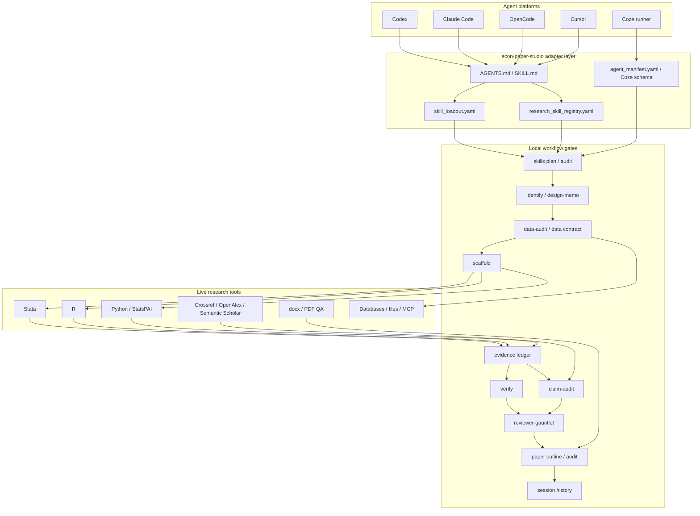
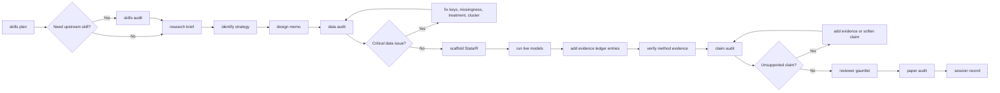
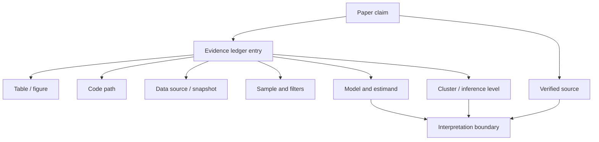
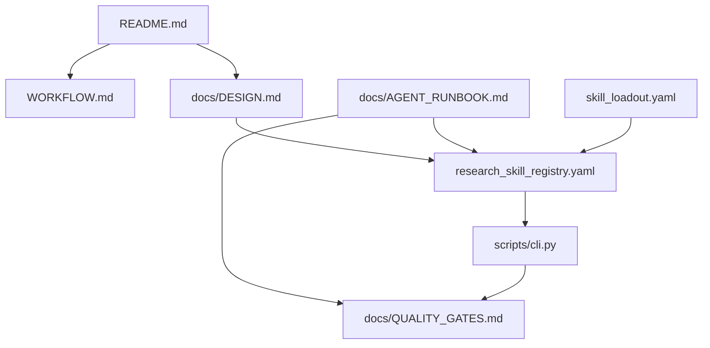

# 设计思路与框架

`econ-paper-studio` 的定位很窄：给 agent 接手实证经济学论文时用。它不是“自动写论文”的工具，也不是把一堆 prompt 拼在一起。它做的是把计量论文里最容易被 agent 跳过、但审稿人一定会追问的环节固定下来：问题、识别、数据、代码、证据、引用、写作和复现。

一句话说：本仓库是 **adapter + 编排层 + 质量闸门**。上游 skills 和真实研究工具负责做具体事情，本仓库负责告诉 agent 什么时候该用什么、哪些证据必须留下、哪些话不能在没证据时写出来。

## 为什么这样设计

用 agent 做计量研究，最危险的不是它不会写代码，而是它太容易把中间步骤省掉：

- 研究问题还没收窄，就直接开始找显著结果；
- 识别假设没写清楚，就开始套 DiD/RDD/IV；
- 数据合并和样本删减没有记录，后面谁也复现不了；
- 表格出来后，正文 claim 和表格、代码、数据对不上；
- 引用看起来像真的，但没有核验来源，也不一定支持文中那句话；
- 草稿读起来完整，却把静态检查包装成了实证结论。

所以这个项目不追求“看起来一步到位”。它追求的是每一步都能被检查、交接和追问。

## 三层框架

这一层设计有两个好处。

第一，agent 平台可以换。Codex、Claude Code、OpenCode、Cursor、Coze 读入口文件的方式不一样，但它们最终都落到同一套 CLI gate 和同一套证据规则上。

第二，研究工具可以换。Stata/R/Python、引用 API、数据库、docx 渲染工具都不是本仓库硬编码的替代品；它们是 agent 在真实项目里应该调用的外部能力。本仓库只负责把调用前后的检查和记录做好。

## 主流程

这里有三条硬规则：

1. 数据没过结构闸门，不继续跑模型。
2. 模型结果没有进 evidence ledger，不写成正文结论。
3. claim audit 找不到证据链，不把它当成论文结论。

## 证据链

`ledger` 和 `claim-audit` 是这个项目区别于普通写作 skill 的地方。它们让 agent 写作时必须回答一个简单问题：这句话靠什么支持？

如果这条链断了，处理方式只有三种：补证据、改写 claim、删掉 claim。不能让 agent 用更漂亮的话把证据缺口盖过去。

## 上游参考如何吸收

本仓库不复制上游项目，只吸收它们的工作方式。

| 上游参考 | 吸收方式 | 本仓库落点 |
|---|---|---|
| Auto-Empirical Research Skills | 把经验研究拆成可加载的 skills，而不是让 agent 一次性“全能接手” | `research_skill_registry.yaml`、`econ-studio skills plan` |
| StatsPAI | 把计量执行和因果推断函数当成 live-tool 参考，不把静态模板当结果 | `identify`、`scaffold`、`verify` |
| Academic Research Skills | 借鉴 research -> write -> review -> revise -> finalize 的论文节奏 | `WORKFLOW.md`、`paper outline/audit`、`session` |
| obra/superpowers | 借鉴计划、排错和完成前核验纪律 | `AGENTS.md`、`QUALITY_GATES.md` |
| Stata skill | 保留 Stata-first 的 do-file 习惯和社区包语境 | `scaffold` 的 Stata 模板 |
| social-science methods skills | 把 DiD/RDD/IV 等方法要求转成可检查项 | `identify`、`verify`、`design-memo` |
| research-writing / humanizer / plotting skills | 把写作质检转成具体规则，避免空话、虚贡献和弱图表标题 | `paper audit`、`references/writing_quality_protocol.md` |
| OpenJudge / reviewer skills | 把审稿视角拆成方法、数据、引用、写作、复现五类问题 | `reviewer-gauntlet` |

## 文件怎样协作

- `README.md` 负责让第一次打开 GitHub 的人快速知道这是什么、怎么跑、去哪看细节。
- `docs/DESIGN.md` 负责解释设计逻辑和框架。
- `WORKFLOW.md` 负责讲真实研究时每一步怎么走。
- `docs/AGENT_RUNBOOK.md` 负责给 agent 一个接手顺序。
- `docs/QUALITY_GATES.md` 负责交付前检查。
- `research_skill_registry.yaml` 和 `skill_loadout.yaml` 给 agent/runner 读。

## 边界

这个项目可以让 agent 少跳步骤，但不能替代研究判断。

- 它不能证明一个数据源真实可靠。
- 它不能证明一个回归结果已经正确执行。
- 它不能证明某篇文献支持正文中的 claim。
- 它不能把弱识别设计变成强识别设计。

它能做的是把这些问题提前摆到桌面上，让研究者和 agent 都知道下一步该补什么。
