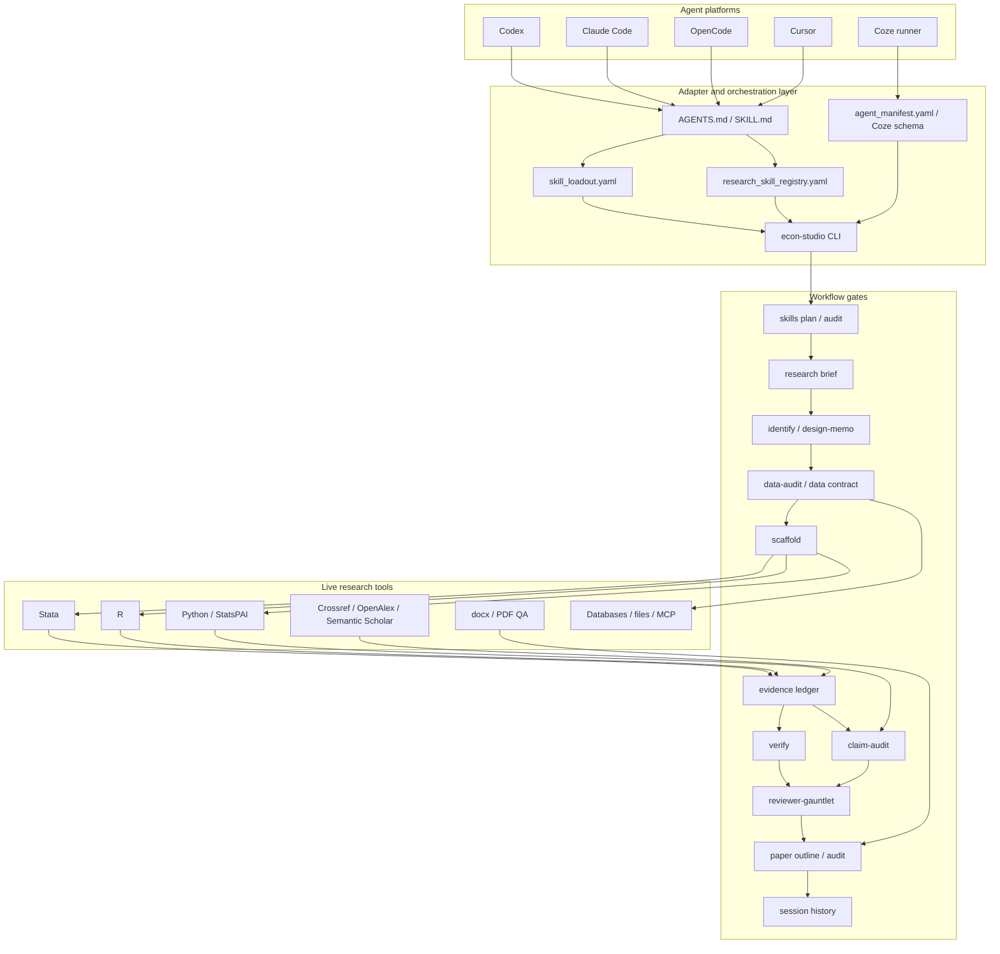
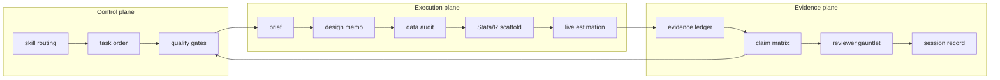
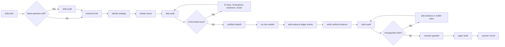
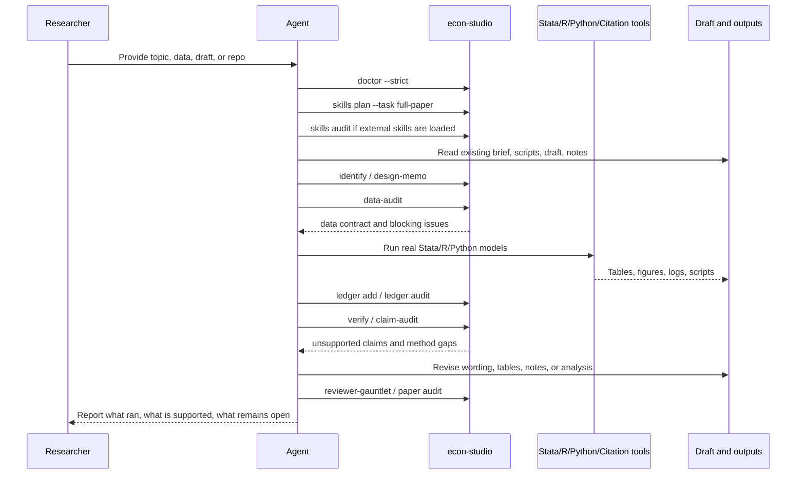
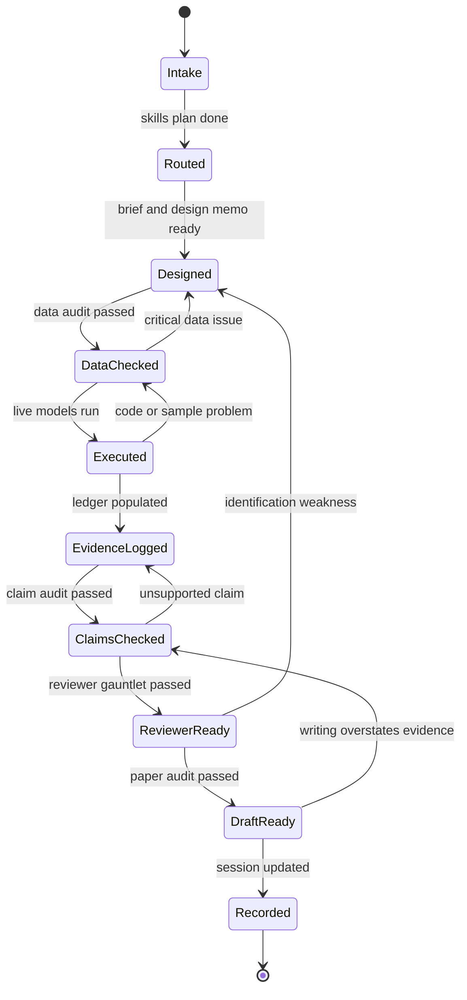
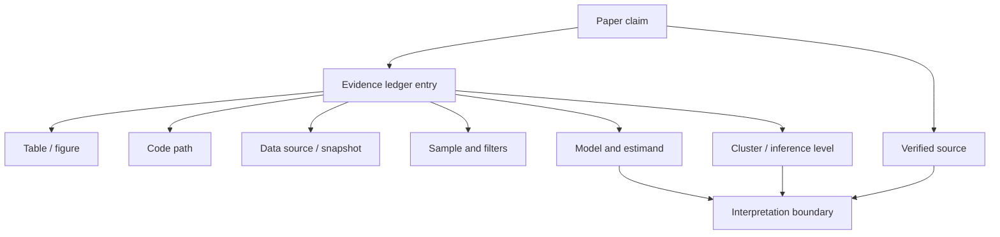
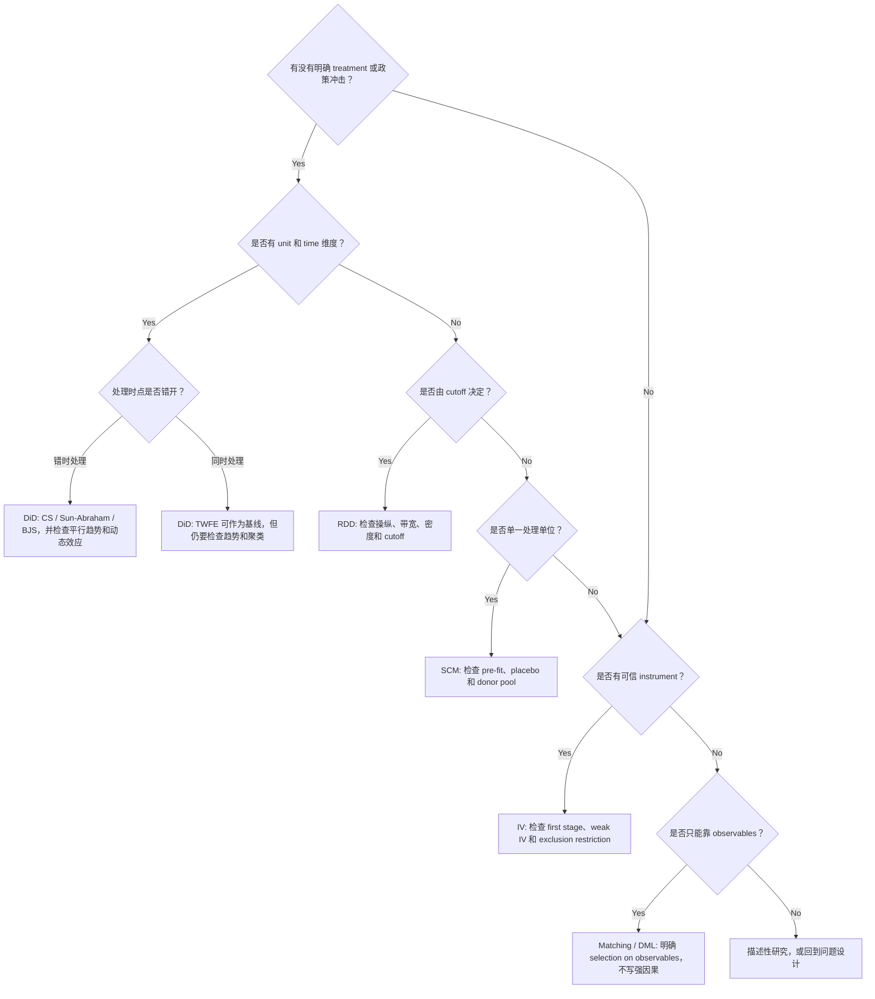
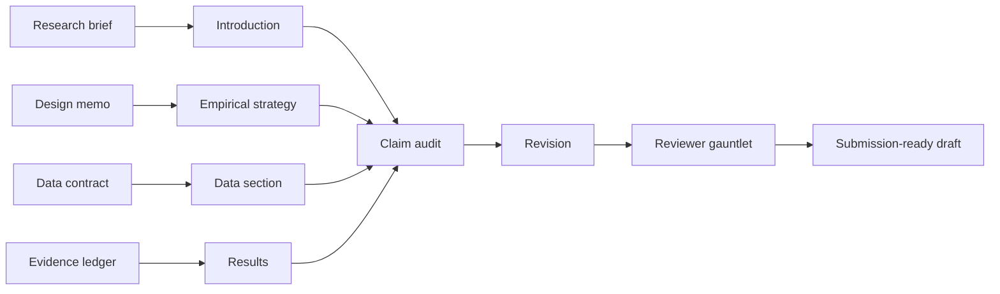
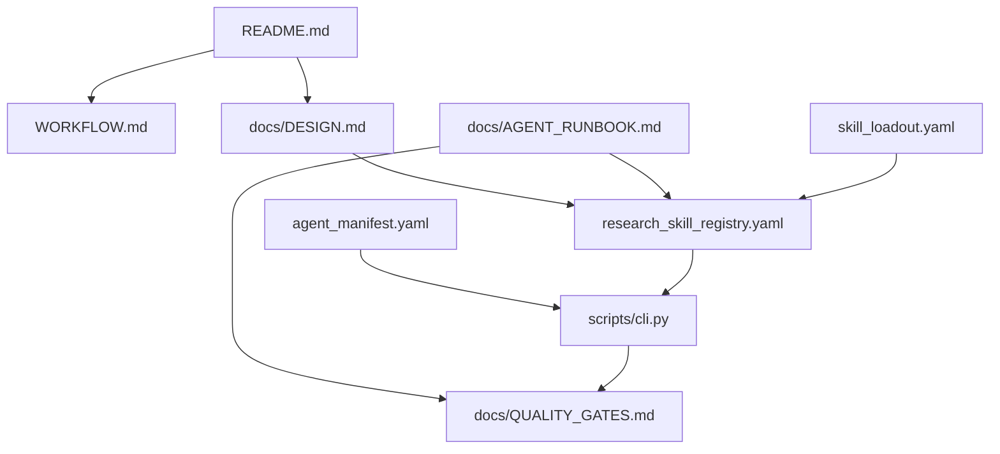

# 设计思路与框架

`econ-paper-studio` 的定位很窄：给 agent 接手实证经济学论文时用。它不是“自动写论文”的工具，也不是把一堆 prompt 拼在一起。它做的是把计量论文里最容易被 agent 跳过、但审稿人一定会追问的环节固定下来：问题、识别、数据、代码、证据、引用、写作和复现。

一句话说：本仓库是 **adapter + 编排层 + 质量闸门**。上游 skills 和真实研究工具负责做具体事情，本仓库负责告诉 agent 什么时候该用什么、哪些证据必须留下、哪些话不能在没证据时写出来。

## 读这篇文档能解决什么

第一次看到这个仓库时，最容易误解成两种东西：一种是论文写作 prompt 集合，另一种是计量代码模板库。它都不是。

这个项目真正解决的是 agent 接手研究任务时的“顺序问题”和“证据问题”：

- 顺序问题：先想清楚研究问题和识别，再碰数据和模型。
- 证据问题：正文里的 claim 必须能回到表图、代码、数据、样本、模型和引用核验状态。
- 交接问题：另一个 agent 或研究者接手时，能看懂已经做了什么、下一步缺什么。
- 边界问题：静态检查、脚手架和真实估计不能混在一起说。

所以这份文档重点讲框架，不讲某一个命令的参数。命令细节看 `docs/CLI_REFERENCE.md`，真实执行顺序看 `docs/AGENT_RUNBOOK.md`。

## 为什么这样设计

用 agent 做计量研究，最危险的不是它不会写代码，而是它太容易把中间步骤省掉：

- 研究问题还没收窄，就直接开始找显著结果；
- 识别假设没写清楚，就开始套 DiD/RDD/IV；
- 数据合并和样本删减没有记录，后面谁也复现不了；
- 表格出来后，正文 claim 和表格、代码、数据对不上；
- 引用看起来像真的，但没有核验来源，也不一定支持文中那句话；
- 草稿读起来完整，却把静态检查包装成了实证结论。

所以这个项目不追求“看起来一步到位”。它追求的是每一步都能被检查、交接和追问。

## 总体框架

这张图里有三个关键点。

第一，agent 平台可以换。Codex、Claude Code、OpenCode、Cursor、Coze 读入口文件的方式不一样，但它们最终都落到同一套 CLI gate 和同一套证据规则上。

第二，研究工具可以换。Stata/R/Python、引用 API、数据库、docx 渲染工具都不是本仓库硬编码的替代品；它们是 agent 在真实项目里应该调用的外部能力。本仓库只负责把调用前后的检查和记录做好。

第三，所有产物都要能交接。`design_memo.md` 说明为什么这样识别，`data_audit.md` 说明样本和变量有没有明显结构问题，`evidence_ledger.json` 说明表图和 claim 的证据来源，`claim_audit.md` 说明正文哪里还缺支持。

## 三条工作平面

为了让框架不散，这个项目把研究任务拆成三条平面：控制平面、执行平面、证据平面。

控制平面回答“现在该做什么”。它把上游 skills、平台入口、质量闸门和 CLI 命令连起来。

执行平面回答“真实研究做了什么”。它包括 brief、识别设计、数据检查、代码骨架和实际模型运行。

证据平面回答“论文里的话靠什么支撑”。它把表图、代码、数据、引用和正文 claim 连起来，让后续写作不会脱离实证证据。

## 核心对象

| 对象 | 文件或命令 | 作用 | 下游会怎么用 |
|---|---|---|---|
| Skill plan | `econ-studio skills plan` | 决定当前任务要加载哪些上游 skills | agent 先读正确 skill，再进入研究任务 |
| Skill audit | `econ-studio skills audit` | 扫描外部 skill 目录风险 | 避免直接加载不清楚来源的脚本或密钥读取逻辑 |
| Research brief | `research_brief.yaml` | 记录问题、数据、treatment、outcome、识别威胁 | `identify` 和 `design-memo` 的输入 |
| Design memo | `econ-studio design-memo` | 写清 estimand、识别假设、威胁和诊断要求 | 后续数据、模型、正文 claim 都要对齐它 |
| Data contract | `econ-studio data-audit` | 记录主键、缺失、重复、聚类、分母和样本边界 | 决定能不能继续跑模型 |
| Analysis scaffold | `econ-studio scaffold` | 生成 Stata/R 项目骨架 | 研究者或 agent 替换真实变量和路径后执行 |
| Evidence ledger | `econ-studio ledger` | 记录表图、代码、数据、样本、模型和 claim | `claim-audit` 和写作阶段读取 |
| Method verification | `econ-studio verify` | 静态检查方法证据和写作风险 | 找出缺少稳健性、引用或限制语的位置 |
| Claim matrix | `econ-studio claim-audit` | 把正文 claim 映射回 ledger | 决定哪些话能写，哪些要补证据或降级 |
| Reviewer report | `econ-studio reviewer-gauntlet` | 从方法、数据、引用、写作、复现看弱点 | 投稿前或交付前的最后一轮压力测试 |
| Session record | `econ-studio session` | 记录版本、审稿意见和终稿 | 长任务交接和回溯 |

这些对象不是为了增加流程感。它们是为了让 agent 在写作时不能凭印象推进：没有 brief，就不知道研究问题；没有 memo，就不知道识别边界；没有 data contract，就不知道样本是否可信；没有 ledger，就不知道 claim 靠什么支撑。

## 主流程

这里有三条硬规则：

1. 数据没过结构闸门，不继续跑模型。
2. 模型结果没有进 evidence ledger，不写成正文结论。
3. claim audit 找不到证据链，不把它当成论文结论。

## Gate 细节

| Gate | 输入 | 输出 | 通过标准 | 失败后怎么处理 |
|---|---|---|---|---|
| skills | 任务类型、可用上游 skills | skill plan / audit report | 已知道该加载哪些技能，外部目录无明显风险 | 先补 skill 来源或换成只读文档模式 |
| research brief | 用户想法、数据说明、目标期刊 | `research_brief.yaml` | X、Y、样本、时间、识别威胁写清楚 | 继续追问，不进入模型阶段 |
| identify | brief | `identify_strategy.md` | 至少有一个可解释的候选策略和排除理由 | 回到 brief，补数据结构或重新收窄问题 |
| design memo | brief / strategy | `design_memo.md` | estimand、识别假设、威胁、诊断项完整 | 不能写成因果 claim，只能描述性推进 |
| data audit | 分析数据、key、outcome、treatment、cluster | `data_audit.md` / data contract | 无空样本、重复键等 critical failure | 修数据、修 key、修 join，再重跑 |
| scaffold | 策略、session、语言 | Stata/R 骨架 | 目录和脚本结构可运行、可替换 | 修改模板或换语言，不把骨架当结果 |
| live execution | 真实 Stata/R/Python 环境 | 表、图、日志、模型结果 | 有可复现代码和输出文件 | 先排错，不跳到写作 |
| ledger | 表图、代码、数据、模型信息 | `evidence_ledger.json` | 每个核心结果都有记录 | 补 ledger，不让结果只存在对话里 |
| verify | 分析目录、论文草稿 | `verify_report.md` | 方法证据和文本边界足够清楚 | 补稳健性、补限制语、补引用核验 |
| claim audit | draft、ledger | `claim_audit.md` | 核心 claim 能回到证据链 | 补证据、改写 claim、删 claim |
| reviewer gauntlet | draft、ledger | `reviewer_gauntlet.md` | 方法、数据、引用、写作、复现无硬伤 | 按报告逐项处理后重跑 |

## Agent 执行序列

下面这张图描述的是 agent 接手真实项目时的交互顺序。重点不是命令多，而是每一步都有能留下来的产物。

如果外部工具不可用，agent 应该明确写出“未真实运行 Stata/R/Python”或“引用未外部核验”。不能把 CLI 静态扫描说成实证完成。

## 状态机

长任务里最容易出问题的是反复修改后忘了当前状态。这个项目按下面的状态推进。

这也是交接时最重要的信息：现在在哪个状态，为什么停在那里，下一步该补什么。

## 证据链

`ledger` 和 `claim-audit` 是这个项目区别于普通写作 skill 的地方。它们让 agent 写作时必须回答一个简单问题：这句话靠什么支持？

如果这条链断了，处理方式只有三种：补证据、改写 claim、删掉 claim。不能让 agent 用更漂亮的话把证据缺口盖过去。

## 方法框架

这个项目不会替研究者决定“哪个方法一定正确”。它只是把方法选择变成一组可检查的问题。

方法 gate 最关心的是三件事：

- 识别威胁有没有写清楚；
- 这个方法解决了哪些威胁，没解决哪些威胁；
- 文中 claim 有没有超过这个方法能支持的范围。

## 写作框架

论文写作不是最后“润色一下”。在这个框架里，写作从一开始就受到 design memo、data contract 和 evidence ledger 约束。

写作检查主要看这些问题：

- 引言里的贡献句是否具体，还是只说“important / novel / significant”；
- 机制、结果和政策含义有没有超出证据；
- 图表标题是否说明样本、估计量、时间、单位和不确定性；
- 引用是否只是摆在那里，还是确实支持对应 claim；
- 限制条件有没有写在该出现的位置，而不是藏在结尾一句话。

## 上游参考如何吸收

本仓库不复制上游项目，只吸收它们的工作方式。

| 上游参考 | 吸收方式 | 本仓库落点 |
|---|---|---|
| Auto-Empirical Research Skills | 把经验研究拆成可加载的 skills，而不是让 agent 一次性“全能接手” | `research_skill_registry.yaml`、`econ-studio skills plan` |
| StatsPAI | 把计量执行和因果推断函数当成 live-tool 参考，不把静态模板当结果 | `identify`、`scaffold`、`verify` |
| Academic Research Skills | 借鉴 research -> write -> review -> revise -> finalize 的论文节奏 | `WORKFLOW.md`、`paper outline/audit`、`session` |
| obra/superpowers | 借鉴计划、排错和完成前核验纪律 | `AGENTS.md`、`QUALITY_GATES.md` |
| Stata skill | 保留 Stata-first 的 do-file 习惯和社区包语境 | `scaffold` 的 Stata 模板 |
| social-science methods skills | 把 DiD/RDD/IV 等方法要求转成可检查项 | `identify`、`verify`、`design-memo` |
| research-writing / humanizer / plotting skills | 把写作质检转成具体规则，避免空话、虚贡献和弱图表标题 | `paper audit`、`references/writing_quality_protocol.md` |
| OpenJudge / reviewer skills | 把审稿视角拆成方法、数据、引用、写作、复现五类问题 | `reviewer-gauntlet` |

这里的原则很简单：上游 skills 负责增强 agent 的专业能力，本仓库负责把它们放进计量论文流程里。换句话说，上游是能力库，本仓库是工作台和检查线。

## 文件怎样协作

- `README.md` 负责让第一次打开 GitHub 的人快速知道这是什么、怎么跑、去哪看细节。
- `docs/DESIGN.md` 负责解释设计逻辑、框架、状态流和证据链。
- `WORKFLOW.md` 负责讲真实研究时每一步怎么走。
- `docs/AGENT_RUNBOOK.md` 负责给 agent 一个接手顺序。
- `docs/QUALITY_GATES.md` 负责交付前检查。
- `research_skill_registry.yaml` 和 `skill_loadout.yaml` 给 agent/runner 读。
- `agent_manifest.yaml` 和 `integrations/coze/` 给平台集成用。

## 平台接入框架

不同 agent 平台接入点不一样，但本项目希望它们最终遵守同一套顺序。

| 平台 | 入口 | 期望行为 |
|---|---|---|
| Codex | `AGENTS.md` / `SKILL.md` | 先读项目指令和设计文档，再跑 CLI gates |
| Claude Code | `SKILL.md` / 本地 skill | 加载本 skill 和上游 skills，按 runbook 执行 |
| OpenCode | `.opencode/skills/econ-paper-studio/SKILL.md` | 把本仓库当作可调用 skill，先做 skills plan |
| Cursor | `.cursor/rules/econ-paper-studio.mdc` | 在相关任务中自动提示读本项目文档 |
| Coze | `integrations/coze/econ-paper-studio-tool-schema.json` | 通过 tool schema 调用 CLI 能力 |

平台入口不应该各自维护一套研究逻辑。研究逻辑放在 `docs/DESIGN.md`、`WORKFLOW.md`、`docs/AGENT_RUNBOOK.md` 和 CLI 里；平台入口只负责把 agent 引到这里。

## 什么算可用

这个项目达到“可用”，不是指它能在没有数据、没有外部工具、没有研究判断的情况下产出一篇论文。可用指的是：

- agent 能知道先读哪些文件、先加载哪些 skills；
- agent 能用 CLI 生成 brief、设计 memo、data contract、ledger 和 audit report；
- agent 能在调用 Stata/R/Python 后，把结果和正文 claim 接起来；
- 另一个人接手时，能看懂当前项目卡在哪一步；
- 没有证据的 claim 会被标出来，而不是被改写得更像论文。

## 边界

这个项目可以让 agent 少跳步骤，但不能替代研究判断。

- 它不能证明一个数据源真实可靠。
- 它不能证明一个回归结果已经正确执行。
- 它不能证明某篇文献支持正文中的 claim。
- 它不能把弱识别设计变成强识别设计。

它能做的是把这些问题提前摆到桌面上，让研究者和 agent 都知道下一步该补什么。
